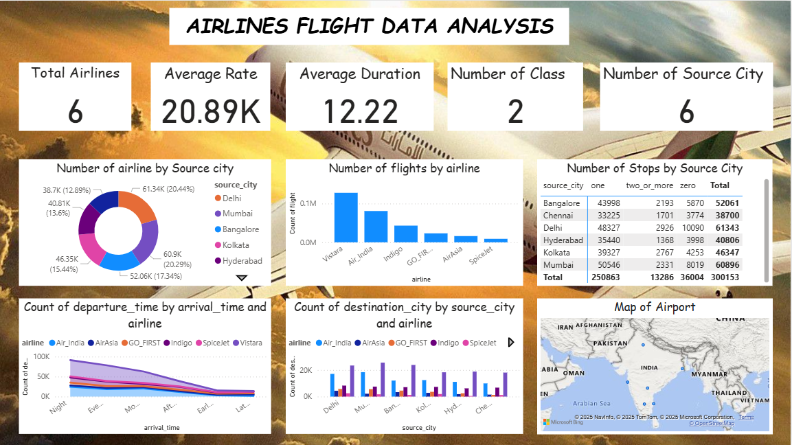

# ✈️ Airlines Flight Data Analysis

This project provides an in-depth analysis of airline flight data using
**Power BI**.\
The dataset includes flight details such as airlines, source cities,
destination cities, stops, duration, and average ticket prices.

## 📂 Project Files

-   **AIRLINES_DATA.pbix** → Power BI project file\
-   **airlines_flights_data.csv** → Raw dataset used for analysis\
-   **Output.png** → Dashboard visualization of flight data analysis

## 📊 Dashboard Insights

1.  **Total Airlines:** 6\
2.  **Average Ticket Price:** 20.89K\
3.  **Average Flight Duration:** 12.22 hrs\
4.  **Number of Classes:** 2\
5.  **Source Cities Covered:** 6

### Key Visuals:

-   ✈️ **Number of Airlines by Source City**\
-   📊 **Number of Flights by Airline**\
-   🛑 **Number of Stops by Source City**\
-   ⏰ **Departure vs Arrival Time by Airline**\
-   🗺️ **Map of Airports**

## 🚀 How to Use

1.  Open the `AIRLINES_DATA.pbix` file in Power BI Desktop.\
2.  Load the dataset `airlines_flights_data.csv`.\
3.  Explore interactive visuals and gain insights into flight patterns.

## 📌 Requirements

-   Power BI Desktop\
-   CSV file (airlines flight data)

## 📷 Dashboard Preview

------------------------------------------------------------------------

🔹 Developed as part of **Airlines Flight Data Analysis Project**
